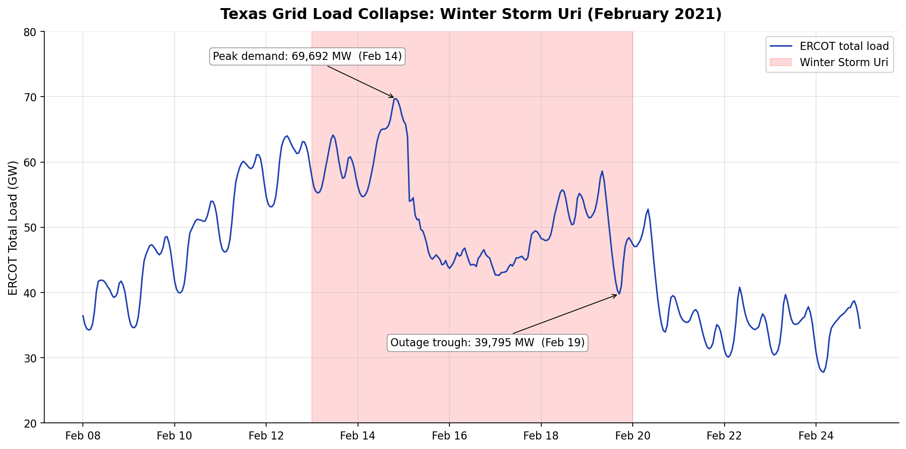

# Texas Grid Load Analytics — ERCOT 2020-2024

An end-to-end analysis of five years of hourly electricity demand on the ERCOT (Electric Reliability Council of Texas) grid, revealing seasonal demand patterns, year-over-year growth, and the operational shock of Winter Storm Uri in February 2021.

> **Status:** 🚧 Work in progress — data pipeline and exploratory analysis complete; interactive dashboard in development.

---

## Why this project

ERCOT operates the electric grid for about 90% of Texas. Their hourly demand data is publicly available, but messy — inconsistent column names across years, a non-standard "24:00" hour-ending convention, daylight saving time quirks, and no built-in joining of weather zones. This project demonstrates the analyst workflow of turning that raw public data into a clean, queryable dataset and surfacing insight a grid operator or energy analyst could actually use.

The featured case study is **Winter Storm Uri (Feb 13-19, 2021)** — the most studied grid event in recent U.S. history — quantifying the load collapse hour by hour.

---

## Key findings



- **Winter Storm Uri (Feb 2021):** Peak demand of 69,692 MW on the eve of the storm collapsed to 39,795 MW during forced outages — a 42.9% drop in served load. Demand didn't fall; supply collapsed and ERCOT was forced to shed load through rolling blackouts.
- **Record summer demand (Aug 2023):** All-time peak of 85,464 MW on August 10, 2023, during a historic Texas heatwave. The top five peak hours in the entire 5-year dataset all fell in August 2023 or August 2024 — a clear signal of how cooling demand has trended upward.
- **Pandemic shutdown trough (May 2020):** The five lowest demand hours in the dataset all occurred in early-morning May 2020, capturing the unusual demand profile during early COVID lockdowns before summer cooling season kicked in.

---

## Data

**Source:** [ERCOT Hourly Load Data Archives](https://www.ercot.com/gridinfo/load/load_hist)

**Coverage:** 2020-2024 (5 years, 43,848 hourly observations)

**Columns:** Timestamp + 8 Texas weather zones (Coast, East, Far West, North, North Central, South, South Central, West) + ERCOT total, all measured in megawatts (MW).

---

## Repository structure

```
texas-ercot-load-analytics/
├── README.md
├── data/
│   ├── raw/                    # Original ERCOT Excel files (not committed)
│   └── processed/              # Cleaned CSV outputs
├── scripts/
│   ├── 01_clean_load_data.py   # Cleaning pipeline
│   └── 02_exploratory_analysis.py
├── sql/
│   └── load_aggregations.sql   # Reusable analytical queries
├── visuals/
│   └── uri_load_collapse.png
└── requirements.txt
```

---

## How to reproduce

```bash
# 1. Clone the repo
git clone https://github.com/JonathanMcCord/texas-ercot-load-analytics.git
cd texas-ercot-load-analytics

# 2. Install dependencies
pip install -r requirements.txt

# 3. Download ERCOT data
# Visit https://www.ercot.com/gridinfo/load/load_hist
# Download "Native_Load_YYYY.xlsx" for each year (2020-2024)
# Unzip into data/raw/

# 4. Run the cleaning pipeline
python scripts/01_clean_load_data.py

# 5. Run the exploratory analysis
python scripts/02_exploratory_analysis.py
```

Outputs:
- `data/processed/ercot_hourly_load_wide.csv` — one row per timestamp, one column per zone (good for time-series analysis)
- `data/processed/ercot_hourly_load_long.csv` — one row per (timestamp, zone) (good for SQL and dashboard tools)
- `visuals/uri_load_collapse.png` — the Uri case study chart

---

## Cleaning challenges addressed

This project tackles four real-world data quality issues in the source files:

1. **Inconsistent column naming.** The 2020 file uses `HourEnding` (no space); later years use `Hour Ending` (with a space). The pipeline normalizes this before concatenation.
2. **ERCOT's 24:00 hour-ending convention.** Hours are labeled 1:00 through 24:00, where "24:00" means midnight starting the *next* day. The pipeline converts these to standard Python timestamps.
3. **Daylight saving time fall-back.** Each year contains one duplicate-hour row flagged "DST." These are preserved with a boolean flag so analyses can include or exclude them deliberately.
4. **Mixed timestamp types.** One row in the 2022 file is stored as a native Python datetime rather than the standard text format. The parser handles both cases gracefully rather than crashing on the anomaly.

---

## Tech stack

- **Python** — pandas, openpyxl, matplotlib
- **SQL** — reusable aggregation queries (SQLite / DuckDB / Postgres compatible)
- **Power BI** *(dashboard in progress)*

---

## Roadmap

- [x] Data acquisition and cleaning pipeline
- [x] Exploratory analysis & Uri case study
- [ ] Interactive Power BI dashboard with weather zone drill-through
- [ ] Year-over-year growth analysis
- [ ] Optional: time-series load forecasting model

---

## About

Built by **Jonathan McCord** as a portfolio project demonstrating end-to-end data analytics workflow on a Texas-specific real-world public dataset.

- **LinkedIn:** [linkedin.com/in/jonathanamccord](https://www.linkedin.com/in/jonathanamccord)
- **GitHub:** [github.com/JonathanMcCord](https://github.com/JonathanMcCord)
