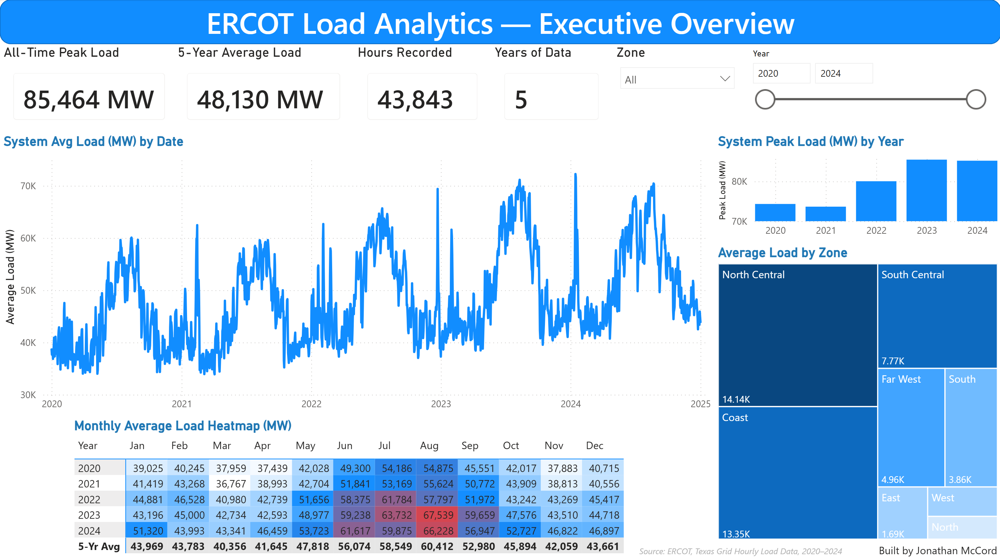
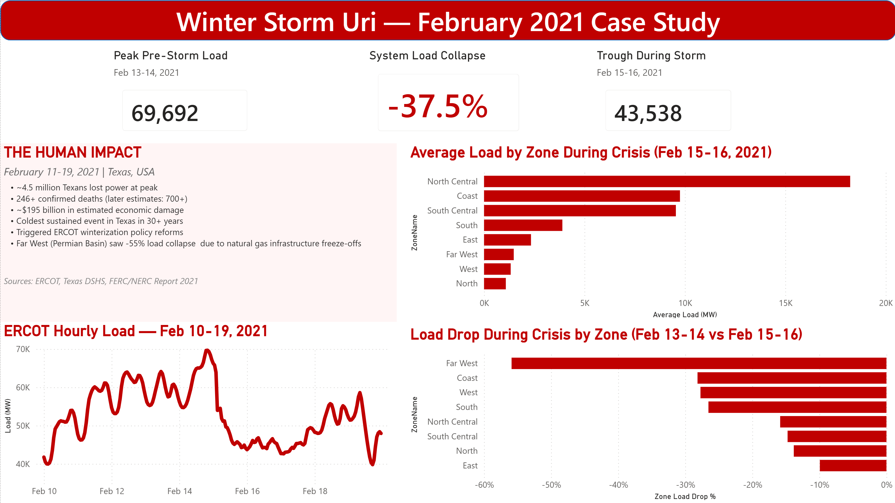
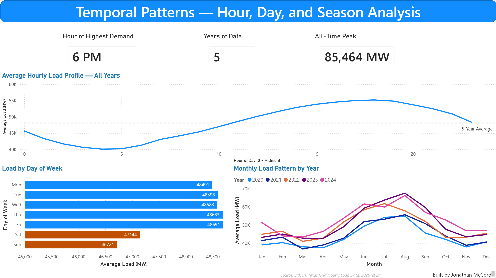
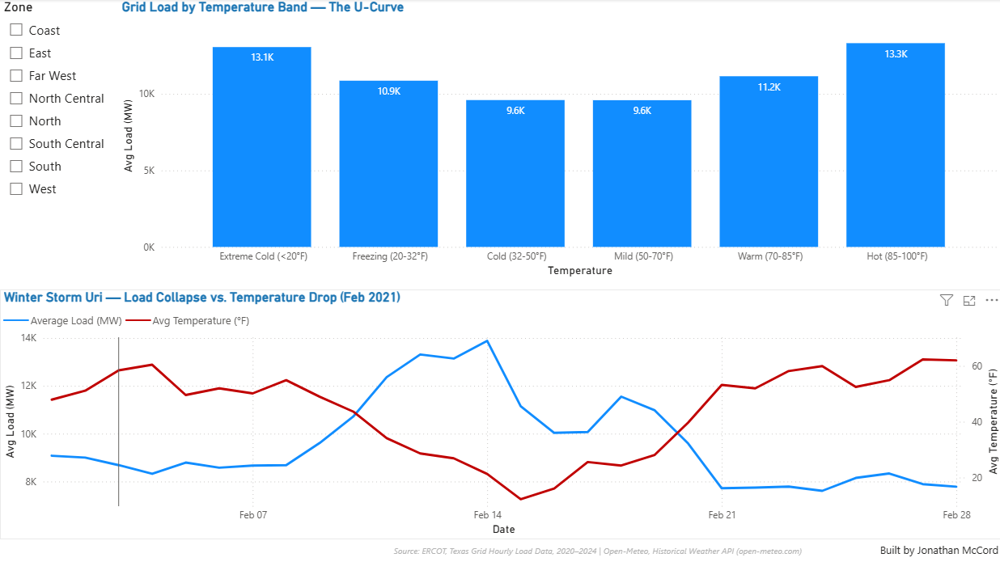

# Texas ERCOT Load Analytics

End-to-end analytics project on 5 years of hourly grid load data from the Electric Reliability Council of Texas (ERCOT), covering Jan 2020 – Dec 2024. Includes a SQL/Python data pipeline, a Winter Storm Uri case study, and a three-page Power BI dashboard.

**Status:** ✅ Phase 1 (Data Pipeline) | ✅ Phase 2 (Analysis) | ✅ Phase 3 (Power BI Dashboard) | ✅ Phase 4 (Weather Integration)

---

## Power BI Dashboard

[View my interactive Texas ERCOT Load Power BI dashboard](https://app.powerbi.com/view?r=eyJrIjoiODA1NjhlZGYtZGUzNy00OTlmLTgxYWUtOGM0MzMyZDAwZjcxIiwidCI6ImRiZmRmZjIwLTlkZjEtNGZjMi05M2FkLWY2ZTU2OWIzNmVjOCJ9&pageName=ee0766fa062e1edfc300)

---

## 📊 Project Snapshot

| Metric | Value |
|---|---|
| Records analyzed | 43,848 hourly load readings + 14,616 daily weather observations |
| Date range | Jan 1, 2020 – Dec 31, 2024 |
| Zones covered | 8 ERCOT load zones + system-wide total |
| Tools | Python, SQL, Power BI, Open-Meteo API |
| Data model | Star schema (FactLoad, DimDate, DimZone, DimWeather) |
| DAX measures | 25+ measures across base, time-intelligence, and event analysis |

---

## 🎯 Key Findings

- **5-Year Peak Load:** 85,464 MW (Aug 2023) — highest demand on record
- **Average System Load:** 48,130 MW across the 5-year period
- **Demand Growth:** August 2023 load was ~23% higher than August 2020, reflecting Texas population growth and electrification
- **Peak Demand Hour:** 6 PM (system-wide hourly profile)
- **Winter Storm Uri Impact:** -37.5% system load collapse (69,692 MW → 43,538 MW) Feb 13-16, 2021
- **Hardest-Hit Zone:** Far West (Permian Basin) experienced -55% load drop due to natural gas infrastructure freeze-offs
- **Weather–Load U-Curve:** Grid demand rises ~38% from mild conditions (9.6K MW at 50–70°F) to extreme heat (13.3K MW at 85–100°F), with a symmetric spike during extreme cold (13.1K MW below 20°F)
- **Uri Weather Overlay:** Temperature and load collapsed in lockstep during Feb 2021, confirming the grid failure was weather-driven

---

## 📁 Repository Structure

```
texas-ercot-load-analytics/
├── README.md
├── data/
│   ├── ercot_hourly_load_long.csv      # Long format: 43,848 × 9 zones
│   ├── ercot_hourly_load_wide.csv      # Wide format: 43,848 rows × 9 zone columns
│   ├── dim_zone.csv                    # Zone dimension table
│   └── dim_weather.csv                 # Daily weather by zone (Open-Meteo API)
├── dashboard/
│   ├── ercot_load_analytics.pbix       # Power BI dashboard file
│   └── visuals/
│       ├── page1_executive_overview.png
│       ├── page2_uri_case_study.png
│       ├── page3_temporal_patterns.png
│       └── page4_weather_impact.png
├── scripts/
│   ├── 01_extract_ercot_data.py
│   ├── 02_clean_and_transform.py
│   └── 03_build_dim_weather.py         # Pulls historical weather from Open-Meteo API
└── docs/
    └── ERCOT_PowerBI_Build_Guide.md
```

*Note: Update the scripts/ filenames to match your actual files.*

---

## 🔧 Phase 1: Data Pipeline

Built a Python and SQL pipeline to ingest, clean, and reshape 5 years of hourly ERCOT load data across 8 zones.

**Pipeline steps:**
1. Extract: Pulled ERCOT public hourly load CSVs (2020-2024)
2. Validate: Handled 5 DST duplicate hours, verified no null values across 43,848 rows
3. Transform: Reshaped wide-format zone-column data into long-format records suitable for analytical modeling
4. Load: Output cleaned long and wide CSVs ready for downstream BI tooling

**Key technical decisions:**
- Used a `is_dst_duplicate` boolean flag rather than dropping DST repeat hours, preserving data integrity
- Maintained both long (analytics-friendly) and wide (executive-friendly) outputs for flexibility
- All datetime values stored as proper timestamps with timezone awareness

---

## 📈 Phase 2: Winter Storm Uri Case Study

Performed a deep-dive analysis of the February 2021 Texas grid disaster.

**Quantified findings:**
- Peak pre-storm demand (Feb 13-14): 69,692 MW
- Trough during blackout cascade (Feb 15-16): 43,538 MW
- System load drop: **-37.5%** over 48 hours
- 217 hours of data analyzed across the Feb 10-19 storm window
- Zone-by-zone impact analysis revealed Far West (Permian Basin) collapsed -55% — more than double any other zone — consistent with FERC/NERC findings on natural gas infrastructure failure

**Human context:**
- ~4.5 million Texans lost power at peak
- 246+ confirmed deaths (later estimates: 700+)
- ~$195 billion estimated economic damage

---

## 📊 Phase 3: Power BI Dashboard

Three-page interactive dashboard built on a star-schema data model with 25+ DAX measures.

### Page 1 — Executive Overview



System-level KPIs, 5-year load trend, annual peak growth, zone distribution, and year-over-month seasonality heatmap. Slicers for Zone and Year enable interactive exploration.

### Page 2 — Winter Storm Uri Case Study



Three hero KPIs (peak, trough, % drop) anchor a dedicated case study page. Hourly timeline shows the cascade and recovery; two zone-level analyses reveal Far West as the disproportionately hardest-hit zone; human-impact context box ties data to lived reality.

### Page 3 — Temporal Patterns



Three-axis temporal analysis: 24-hour load profile (peak at 6 PM), day-of-week pattern (visible weekend dip), and monthly seasonality overlaid across all five years (clear year-over-year demand growth).

### Page 4 — Weather Impact



Integrates external weather data (Open-Meteo API) to quantify the relationship between temperature and grid demand. The U-curve chart reveals that load rises ~38% from mild to extreme temperatures. A dual-axis overlay of February 2021 shows temperature and load collapsing in lockstep during Winter Storm Uri. Zone slicer enables weather-sensitivity comparison across regions.

---

## 🌡 Phase 4: Weather Integration

Integrated external weather data to analyze the relationship between temperature and grid demand.

**Pipeline:**
- Built a Python script (`03_build_dim_weather.py`) that pulls 5 years of daily weather from the Open-Meteo Historical API for 8 representative Texas cities — one per ERCOT zone
- Output includes daily high/low/mean temperature (°F), feels-like temperature, max wind speed, precipitation, snowfall, and derived temperature categories

**Data model extension:**
- Added DimWeather as a shared-dimension table connecting to DimDate and DimZone with bidirectional cross-filtering
- This creates a multi-source star schema where hourly load data and daily weather data are analyzed together through common dimensions

**Key findings:**
- Grid demand follows a U-shaped curve: highest at extreme cold (13.1K MW) and extreme heat (13.3K MW), lowest during mild conditions (9.6K MW)
- Hot weather pulls slightly more load than extreme cold, consistent with Texas where AC is the dominant demand driver
- February 2021 overlay confirms temperature and load collapsed simultaneously during Winter Storm Uri

---


### Data Model

```
                    [DimDate]
                   ╱         ╲
          (Date) ╱             ╲ (date)
               ╱                 ╲
       [FactLoad]              [DimWeather]
               ╲                 ╱
  (zone → ZoneCode) ╲       ╱ (ZoneCode)
                      ╲   ╱
                    [DimZone]
```

- **FactLoad** — 43,848 hourly load records (grain: zone × hour)
- **DimDate** — date dimension with Year, Quarter, Month, Day, DayOfWeek, IsWeekend, Season
- **DimZone** — 9-row zone dimension with `IsZone` flag separating sub-zones from system rollup
- **DimWeather** — 14,616 daily weather observations (grain: zone × day) with temperature, wind, precipitation, and derived temperature categories

### Key DAX Measures

Includes time-intelligence (YoY Change %, Peak Load YTD), event-window measures (Uri Peak Pre-Storm, Uri Min During Storm, Uri Load Drop %), zone-aware measures (Zone Avg Load with `IsZone = TRUE` filter to prevent double-counting), and helper measures (Peak Hour Label using FORMAT for human-readable display).

---

## 🛠 Tools & Technologies

- **Python:** pandas, datetime handling, data validation, API integration
- **SQL:** data transformation, aggregation, reshaping
- **Power BI Desktop:** data modeling, DAX, visualization, shared-dimension star schema
- **Open-Meteo API:** historical weather data (temperature, wind, precipitation)
- **Git/GitHub:** version control and project hosting


---

## 🚀 How to Reproduce

1. Clone this repository
2. Open `dashboard/ERCOT_dashboard.pbix` in Power BI Desktop (free download from Microsoft)
3. Update data source paths to point to the local `data/` folder if needed (Transform Data → Data source settings)
4. Refresh the model

To run the data pipeline scripts (Phase 1):
1. Install Python dependencies: `pandas`, `sqlalchemy` (if applicable)
2. Update `BASE_DIR` constants in the scripts to match your local path
3. Run scripts in numbered order (01 & 02)

To pull weather data (Phase 4):
1. Install Python dependencies: `pip install requests pandas`
2. Run `python scripts/03_build_dim_weather.py`
3. The script pulls from the free Open-Meteo API (no API key required) and outputs `dim_weather.csv` to the data folder

---

## 📌 About This Project

Built as part of a portfolio demonstrating end-to-end analytical capability:
- Pipeline engineering (data ingestion → cleaning → transformation)
- Analytical thinking (case-study methodology, comparative zone analysis)
- BI delivery (star schema modeling, interactive dashboards, stakeholder-ready visuals)

Domain: Energy / utility analytics
Use cases: grid demand forecasting, disaster impact analysis, load growth trending

---

## 👤 Author

**Jonathan McCord**
- LinkedIn: [linkedin.com/in/jonathanamccord](https://linkedin.com/in/jonathanamccord)
- GitHub: [github.com/JonathanMcCord](https://github.com/JonathanMcCord)
- Currently completing MS in Data Science at Ball State University (July 2026, 4.0 GPA)
- Data Analyst at Pestco Pro

---

## 📜 Data Source & Acknowledgments

**Load data** sourced from ERCOT public archive. ERCOT is the Electric Reliability Council of Texas, the independent system operator for the Texas grid covering ~90% of the state's electricity load.

**Weather data** sourced from [Open-Meteo Historical Weather API](https://open-meteo.com/en/docs/historical-weather-api) — daily temperature, wind, and precipitation for 8 Texas cities representing each ERCOT zone.

Winter Storm Uri impact figures cited from ERCOT, Texas Department of State Health Services (DSHS), and the joint FERC/NERC report on the February 2021 cold-weather event.

---

## 📄 License

This project is for portfolio/educational purposes. Data is from public ERCOT archives.
